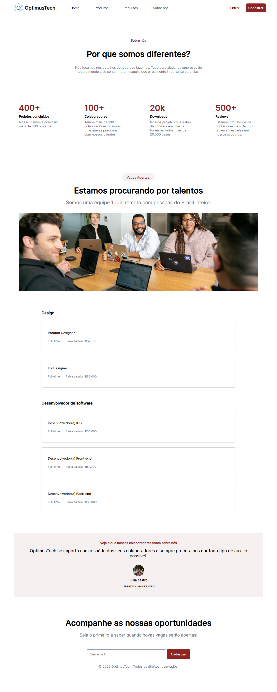

# 7DaysOfCode

Neste projeto tive o objetivo de desenvolver este site em 7 dias utilizando apenas HTML e CSS, todo o projeto foi diponibilizado pela <a href="https://github.com/giovannamoeller/7daysofcode-html-css">@giovannamoeller</a> com toda a resolução completa já disponível em seu repositório.

Este é apenas minha maneira que encontrei de fazer o projeto, em breve pretendo iniciar toda a alteração no projeto com o foco na maior responsividade do projeto, conforme avançar em meus estudos irei colocar mais recursos e funções a todo site.
O link para meu projeto está logo abaixo:

<a href="https://nathan-gomes.github.io/7DaysOfCode/">7 Days of code</a>

